title: 敏捷项目管理浅见  
speaker: 时扬扬
theme: dark
files: assets/css/font-awesome.css
from: https://www.zhihu.com/question/19638322

[slide]
# 敏捷项目管理 (Scrum)
<small>演讲者: 时扬扬</small>

[slide]
# 敏捷项目管理目的
## （一）适应变化
> Scrum 的一个基本假设，就是外部需求模糊而难以理解。
> Scrum 对此的理念是：让客户直接看到半成品，他们才知道自己要什么。
> 完整的项目有时候是对资源的浪费

[slide]
# 敏捷项目管理目的
## （二）快速迭代
> Scrum 的另一个基本假设，激烈的团队竞争导致快速的产品功能。
> Scrum 对此的理念是：发布即 Milestone（里程碑），宁可每次发布20个功能，也不要积攒100个功能一次性发布。

[slide]
# 敏捷项目管理目的
## （三）打磨团队
> 团队是项目的主体，每个团队都有自己的特色。
> 在团队协作中磨合，为面临更多的挑战做好基础。

[slide data-transition="vertical3d"]
# [敏捷软件开发宣言](http://agilemanifesto.org/iso/zhchs/manifesto.html)
1. 个体和互动 高于 流程和工具 {:&.bounceIn}
1. 工作的软件 高于 详尽的文档
1. 客户合作 高于 合同谈判
1. 响应变化 高于 遵循计划

[slide data-transition="zoomin"]
# 敏捷软件开发角色
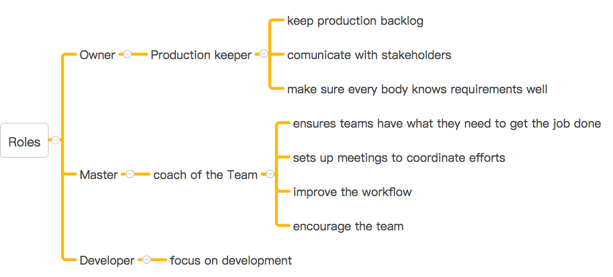

[slide data-transition="newspaper"]
# 四个会议
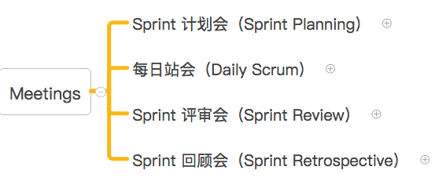

[slide data-transition="newspaper"]
# 计划会
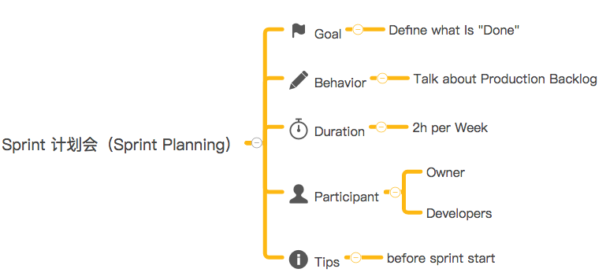

[slide]
# 计划会 
归档上一个运行时 Sprint
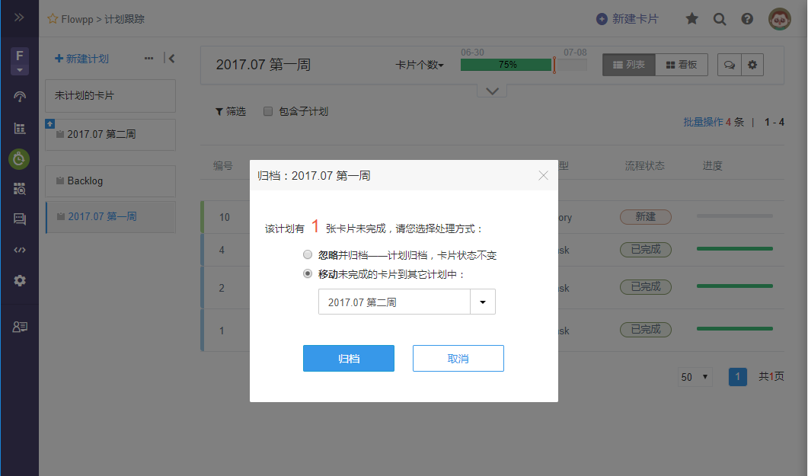

[slide]
# 计划会
从Backlog中拉取优先级最高的 Story
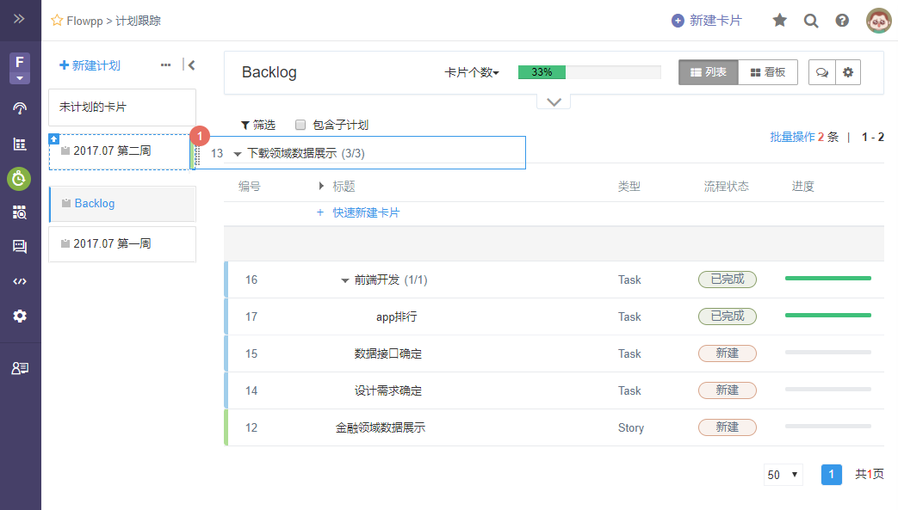

[slide]
# 计划会
优先级排序
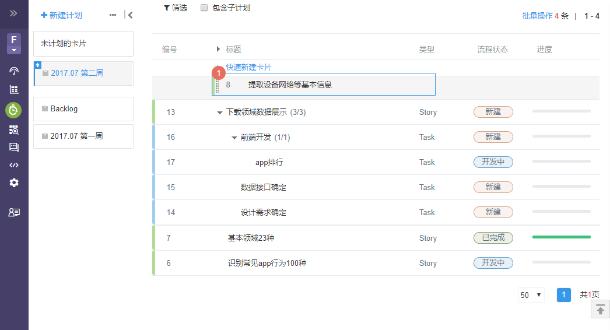

[slide]
# 每日站会
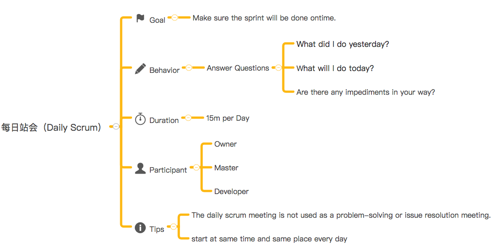

[slide]
# 每日站会 Board
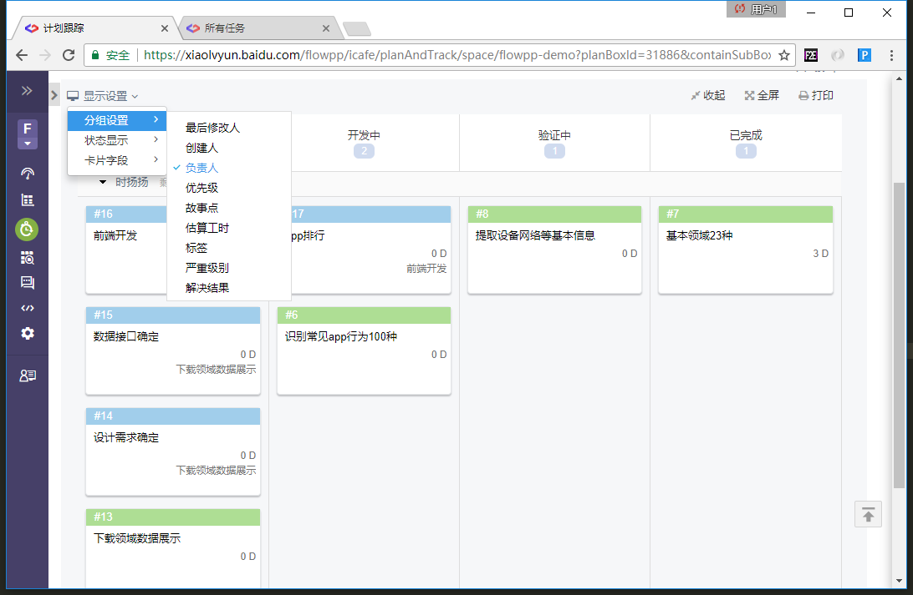

[slide]
# 评审会
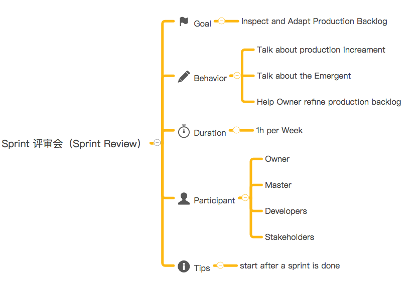

[slide]
# 评审会 Board
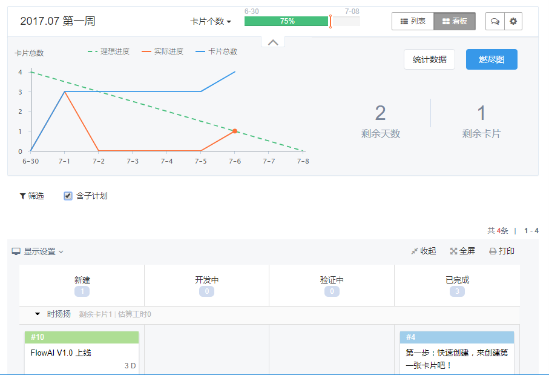

[slide]
# 回顾会
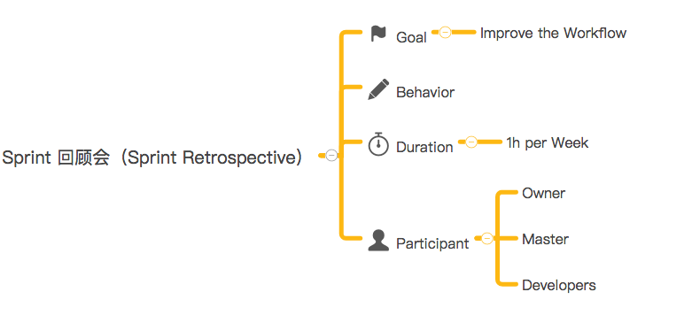

[slide data-transition="vertical3d"]
# 效率云iCafe
百度内部敏捷实践的先驱
[http://xiaolvyun.baidu.com](http://xiaolvyun.baidu.com)

[slide data-transition="vertical3d"]
# 计划跟踪 
1. ### 定目标  
  - 拆卡片
  - 估工时
2. ### 做计划
  - 更新卡片
  - 任务提醒
  - 归档计划
3. ### 看进度  
  - 展示燃尽图
  - 看层级进度
  - 看板和泳道

[slide]
# 高级功能
1. 计划调整 & 无限计划层级
2. 任务查看 & 任务分配
3. 历史卡片查询
4. 讨论分享
5. 产品规划
6. 项目、类型、字段、流程配置

[slide]
# Q&A
